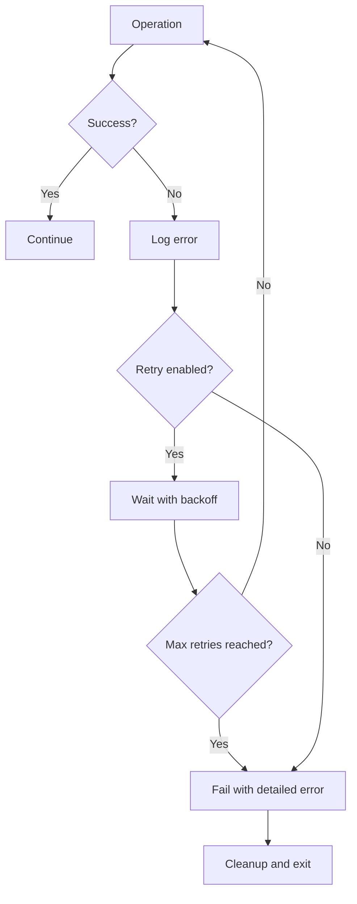

# Architecture Documentation

## System Overview

The GLM Code Review Bot follows a modular, layered architecture designed for extensibility, testability, and maintainability. The system integrates with GitLab CI/CD to provide automated code reviews using the GLM-4 language model.

```
┌─────────────────────────────────────────────────────────────┐
│                      GitLab CI/CD Pipeline                  │
└───────────────────────┬───────────────────────────────────────┘
                        │
                        │ Triggers on MR events
                        ▼
┌─────────────────────────────────────────────────────────────┐
│                  review_bot.py (Entry Point)                │
│  ┌─────────────────┐  ┌─────────────────┐  ┌──────────────┐ │
│  │   CLI Runner    │  │   Review Proc.  │  │ Env. Validator│ │
│  │                 │  │                 │  │              │ │
│  │ - Arg parsing   │  │ - Orchestrate   │  │ - Validate   │ │
│  │ - Logging setup │  │ - Error handling│  │ - Config     │ │
│  └─────────────────┘  └─────────────────┘  └──────────────┘ │
└───────────────────────┬───────────────────────────────────────┘
                        │
                        │ Coordinates components
                        ▼
┌─────────────────────────────────────────────────────────────┐
│                  Business Logic Layer                       │
│                                                           │
│  ┌─────────────────┐  ┌─────────────────┐  ┌──────────────┐ │
│  │   Diff Parser   │  │ Comment Publisher│  │ GLM Client   │ │
│  │                 │  │                 │  │              │ │
│  │ - Parse diffs   │  │ - Format comments│  │ - API calls  │ │
│  │ - Chunk files   │  │ - Publish to MR │  │ - Rate limit │ │
│  │ - Filter files  │  │ - Retry logic   │  │ - Token est.│ │
│  └─────────────────┘  └─────────────────┘  └──────────────┘ │
└───────────────────────┬───────────────────────────────────────┘
                        │
                        │ External integrations
                        ▼
┌─────────────────────────────────────────────────────────────┐
│                  Integration Layer                          │
│                                                           │
│  ┌─────────────────┐              ┌───────────────────────┐ │
│  │  GitLab Client  │              │     GLM API          │ │
│  │                 │              │                       │ │
│  │ - Get MR diffs  │◄────────────►│ - Analyze code       │ │
│  │ - Post comments │              │ - Generate feedback   │ │
│  │ - Handle errors │              │ - Return structured   │ │
│  └─────────────────┘              │   comments            │ │
│                                   └───────────────────────┘ │
└─────────────────────────────────────────────────────────────┘
                        │
                        │ Configuration & Utilities
                        ▼
┌─────────────────────────────────────────────────────────────┐
│                Infrastructure Layer                         │
│                                                           │
│  ┌─────────────────┐  ┌─────────────────┐  ┌──────────────┐ │
│  │   Settings      │  │     Logger      │  │   Retry      │ │
│  │                 │  │                 │  │              │ │
│  │ - Env variables │  │ - Structured    │  │ - Backoff     │ │
│  │ - Validation    │  │ - Filter sens.  │  │ - Retry types │ │
│  │ - Type safety   │  │   data         │  │ - Circuit br.│ │
│  └─────────────────┘  └─────────────────┘  └──────────────┘ │
└─────────────────────────────────────────────────────────────┘
```

## Component Architecture

### 1. Entry Point Layer (`review_bot.py`)

The entry point provides the main CLI interface and orchestrates the entire review process.

#### Key Classes:
- **CLIRunner**: Handles command-line arguments, logging setup, and process execution
- **ReviewProcessor**: Orchestrates the review workflow and coordinates components
- **ReviewContext**: Maintains state throughout the review process
- **EnvironmentValidator**: Validates configuration and environment

#### Responsibilities:
- Parse and validate command-line arguments
- Initialize logging with appropriate configuration
- Validate environment variables and configuration
- Coordinate the review workflow
- Handle top-level errors and provide meaningful error messages

### 2. Business Logic Layer

#### Diff Parser (`src/diff_parser.py`)

Processes and analyzes GitLab diff data to prepare it for review.

```python
class DiffParser:
    """Handles parsing and chunking of GitLab diffs."""
    
    def parse_gitlab_diff(self, diff_data: List[Dict]) -> List[FileDiff]:
        """Parse raw GitLab diff into structured FileDiff objects."""
        
    def chunk_large_diff(self, file_diffs: List[FileDiff]) -> List[DiffChunk]:
        """Split large diffs into manageable chunks within token limits."""
```

**Key Features:**
- Converts GitLab diff format to structured data
- Handles file filtering based on patterns
- Implements intelligent chunking for large files
- Extracts line numbers for inline comments
- Estimates token usage for optimal processing

#### GLM Client (`src/glm_client.py`)

Manages communication with the GLM-4 API for code analysis.

```python
class GLMClient:
    """Client for GLM-4 API integration."""
    
    def analyze_code(
        self, 
        diff_content: str, 
        review_type: ReviewType,
        custom_prompt: Optional[str]
    ) -> Dict[str, Any]:
        """Analyze code changes using GLM-4 model."""
```

**Key Features:**
- Handles authentication and API requests
- Implements retry logic with exponential backoff
- Tracks token usage and limits
- Parses and validates API responses
- Supports different review types and custom prompts

#### Comment Publisher (`src/comment_publisher.py`)

Formats and publishes review comments to GitLab merge requests.

```python
class CommentPublisher:
    """Formats and publishes code review comments."""
    
    def format_comments(self, glm_response: Dict) -> CommentBatch:
        """Transform GLM response into structured comments."""
        
    def publish_comment_batch(self, batch: CommentBatch) -> Dict:
        """Publish formatted comments to GitLab MR."""
```

**Key Features:**
- Transforms GLM responses into structured comments
- Supports different comment types and severity levels
- Handles both inline and general comments
- Implements rate limiting for API compliance
- Provides rich formatting with markdown and emojis

### 3. Integration Layer

#### GitLab Client (`src/gitlab_client.py`)

Handles all interactions with the GitLab API.

```python
class GitLabClient:
    """Client for GitLab API interactions."""
    
    def get_merge_request_diff(self) -> str:
        """Fetch the merge request diff from GitLab."""
        
    def post_inline_comment(self, file_path: str, line_number: int) -> Dict:
        """Post an inline comment to specific line."""
```

**Key Features:**
- Authenticates with GitLab using tokens
- Fetches merge request details and diffs
- Posts both summary and inline comments
- Handles API errors and rate limits
- Formats diffs for analysis

### 4. Infrastructure Layer

#### Settings (`src/config/settings.py`)

Manages application configuration with type safety.

```python
@dataclass
class Settings:
    """Type-safe configuration management."""
    
    gitlab_token: str = field(default_factory=lambda: os.getenv("GITLAB_TOKEN"))
    glm_api_key: str = field(default_factory=lambda: os.getenv("GLM_API_KEY"))
    
    def __post_init__(self):
        """Validate configuration on initialization."""
```

**Key Features:**
- Type-safe configuration with Pydantic
- Environment variable management
- Validation of required settings
- Default values for optional settings
- File pattern configuration

#### Logging (`src/utils/logger.py`)

Provides structured logging with sensitive data filtering.

```python
def setup_logging(level: str, format_type: str) -> None:
    """Setup structured logging with appropriate handlers."""
    
class SensitiveDataFilter:
    """Filters sensitive information from log output."""
```

**Key Features:**
- Structured logging in JSON format
- Sensitive data filtering
- Configurable log levels
- Correlation ID support
- Multiple output handlers

#### Retry Logic (`src/utils/retry.py`)

Implements retry mechanisms with exponential backoff.

```python
@retry_with_backoff(RetryConfig(max_retries=3))
def api_call():
    """Function with automatic retry logic."""
    pass
```

**Key Features:**
- Configurable retry policies
- Exponential backoff with jitter
- Circuit breaker pattern
- Different retry strategies for different operations
- Detailed retry logging

## Data Flow

### Review Process Flow

1. **Initialization**
   ```mermaid
   graph TD
       A[CI Pipeline Trigger] --> B[CLIRunner.parse_args]
       B --> C[EnvironmentValidator.validate]
       C --> D[Setup logging]
       D --> E[ReviewProcessor.init]
   ```

2. **Data Fetching**
   ```mermaid
   graph TD
       A[ReviewProcessor] --> B[GitLabClient.get_mr_details]
       B --> C[GitLabClient.get_mr_diff]
       C --> D[DiffParser.parse_gitlab_diff]
       D --> E[DiffParser.chunk_large_diff]
   ```

3. **Analysis**
   ```mermaid
   graph TD
       A[DiffChunk] --> B[GLMClient.analyze_code]
       B --> C[GLM API]
       C --> D[GLMClient.parse_response]
       D --> E[Token usage tracking]
   ```

4. **Comment Publishing**
   ```mermaid
   graph TD
       A[GLM Response] --> B[CommentPublisher.format_comments]
       B --> C[CommentBatch]
       C --> D[GitLabClient.post_comment]
       D --> E[Inline/General comments]
   ```

### Error Handling Flow



## Configuration Architecture

### Environment Hierarchy

1. **Environment Variables**: Primary configuration source
2. **Default Values**: Fallbacks for optional settings
3. **Validation Rules**: Ensures configuration consistency

### Configuration Categories

- **API Configuration**: URLs, tokens, model parameters
- **Processing Configuration**: Chunking, filtering, limits
- **Review Configuration**: Types, severity, patterns
- **Logging Configuration**: Format, level, output
- **Performance Configuration**: Rate limiting, timeouts, retries

## Security Architecture

### API Key Management

- Environment variable storage
- Sensitive data filtering in logs
- Secure transmission over HTTPS
- No persistence of keys

### Input Validation

- Path traversal prevention
- Content type validation
- Token limit enforcement
- Sanitization of user inputs

## Performance Architecture

### Token Management

- Accurate token estimation using tiktoken
- Intelligent chunking within limits
- Priority-based file processing
- Token usage tracking and reporting

### API Efficiency

- Batching where possible
- Proper request sequencing
- Timeout handling
- Connection pooling

## Extensibility Architecture

### Plugin System

The architecture supports easy extension:

1. **New Review Types**: Add enum values and prompts
2. **Custom Comment Formats**: Extend formatting logic
3. **Additional File Filters**: Configure new patterns
4. **Alternative Models**: Implement new client interfaces

### Configuration Patterns

- Enum-based type selection
- Strategy pattern for different operations
- Factory pattern for client creation
- Observer pattern for logging

## Testing Architecture

### Test Organization

```
tests/
├── unit/              # Individual component tests
├── integration/        # Component interaction tests
├── fixtures/          # Test data and mocks
└── conftest.py       # Shared test configuration
```

### Mock Strategy

- API mocking for external services
- Fixtures for consistent test data
- Dependency injection for testability
- Isolated test environments

This architecture provides a solid foundation for the code review bot, ensuring it's maintainable, extensible, and reliable in production environments.